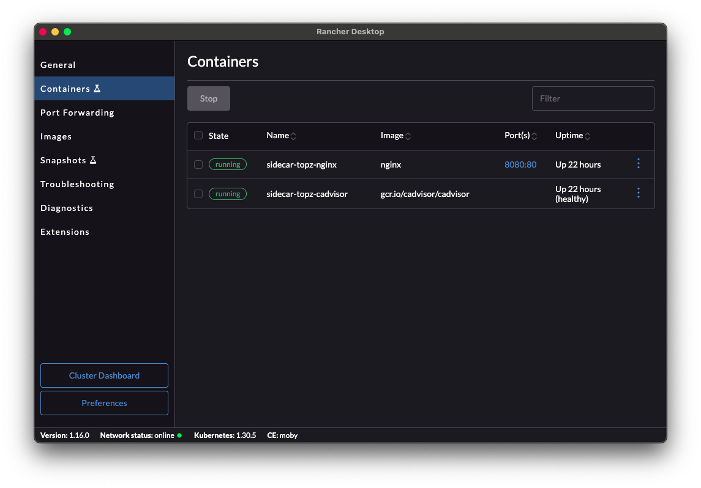
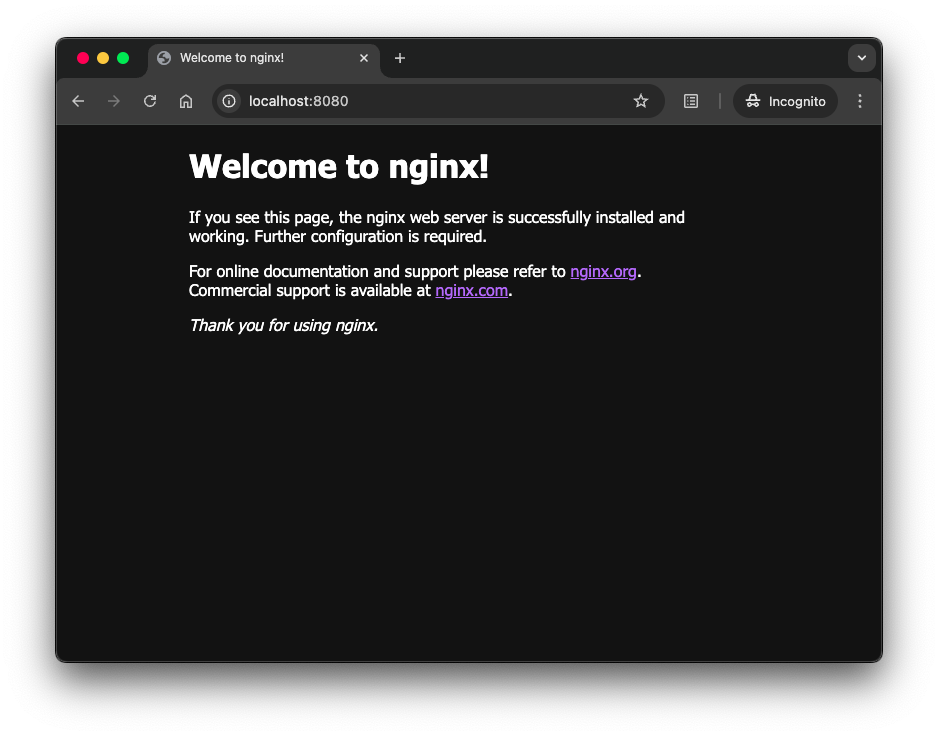
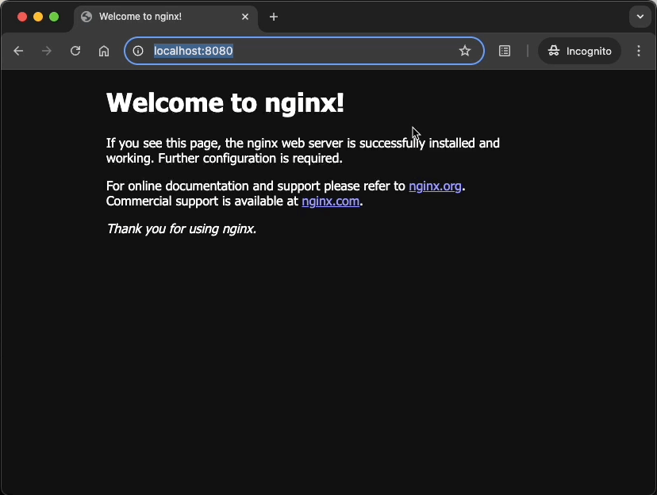
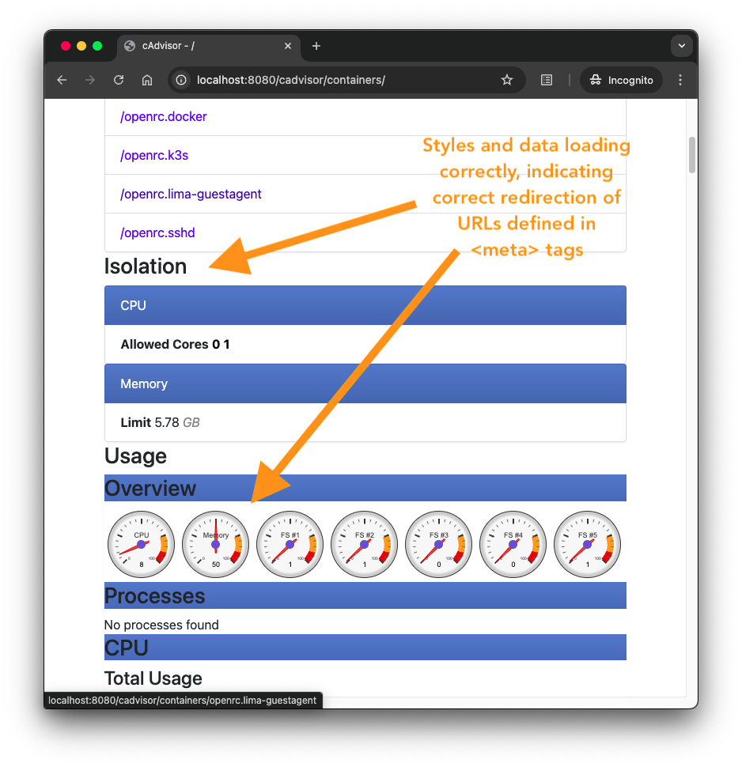
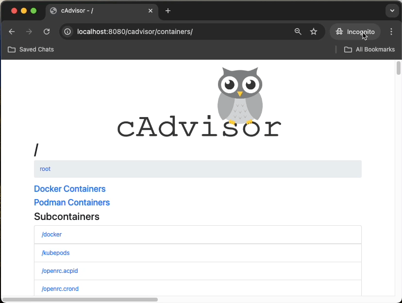

### Running the solution
In the directory that contains the solution files:
Run the following command to start the solution implementation (will run on port :8080)

```
docker-compose up -d
```

<details>
<summary>Screen captures</summary>




</details>

#### Observe the solution
With the Docker stack running:
* point your browser to [`localhost:8080`][main-app] to see the default NGINX welcome page... this is a stand-in for the "main application"
* point your browser to [`localhost:8080/cadvisor`][subdomain-root] or [`localhost:8080/cadvisor/containers`][cadvisor-main] to see the UI of the cadvisor sidecar
* Navigate the cadvisor page to be sure the links work, and external resources are loading (you should see graphs, gauges, _etc._ with data updating in real time)

:::caution
If running in Mac OS, you will see regularly recurring `500` errors, if you check the Network tabs. This is because cAdvisor is trying to invoke a command that runs the `ps` command-line utility to retrieve some additional system data. This utility is not available on Mac OS. But the absence of this data doesn't otherwise affect cAdvisor, and it remains a useful and valuable tool withoutt these calls.
:::

<details>
<summary>Screen captures</summary>



_Note: navigating to `/cadvisor` (which has no actual content) redirects to `/cadvisor/containers`, which is the root of the cAdvisor content.





</details>

#### Stopping the solution
Navigate to this folder in your clone of this repository
Run the following command:
```
docker-compose down
```

<details>
<summary>Screen capture</summary>


</details>

<!-- NAMED LINKS -->
[main-app]: http://localhost:8080

[subdomain-root]: http://localhost:8080/cadvisor/

[cadvisor-main]: http://localhost:8080/cadvisor/containers