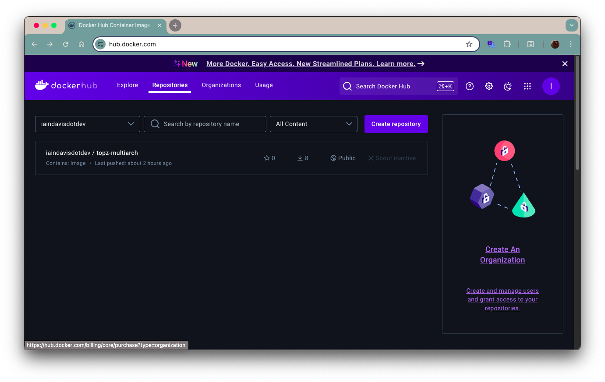

import Expandable from '@site/src/components/Expandable/Expandable'

### Creating Your Own Multi-Architecture Topz Image
#### Prequisites
* Docker Hub account and command-line access
* A current docker login session

I'm using Rancher Desktop (v1.16.0), configured to use `dockerd` as the container engine. I'm working on a Macbook Pro with Apple Silicon (M1) running on Mac OS Sonoma 14.6. I'm using Docker Hub as my image repository, under the name `iaindavisdotdev`.

1. **Activate QEMU for Cross-Platform Builds**
    <Expandable>
    - Run the following command to set up QEMU for cross-platform emulation.

        :::info
        This command installs QEMU emulation support in Docker, enabling cross-platform builds by allowing the host system to build and run images for architectures different from its own.
        :::

        ```bash
        docker run --rm --privileged docker/binfmt:a7996909642ee92942dcd6cff44b9b95f08dad64
        ```
    </Expandable>

2. **Create and Use a Multi-Architecture Builder:**
    - Initialize a new Buildx builder for multi-architecture without requiring any experimental flags.

        ```bash
        docker buildx create --name multiarchbuilder --use
        docker buildx inspect --bootstrap
        ```

3. **Write a New Dockerfile**
   Create a new `Dockerfile` to use `brendanburns/topz:db0fa58` as the base:
   ~~~dockerfile
   # Start from the existing topz image
   FROM brendanburns/topz:db0fa58
   ~~~

5. **Build the Multi-Architecture Docker Image:**
    - Using `brendanburns/topz:db0fa58` as a reference, build your local image. This example skips pushing to a registry:

        ```bash
        docker buildx build --platform linux/amd64,linux/arm64 -t <docker-user>/topz-multiarch:latest --load .
        ```
        


6. **Run the `topz` Container Locally:**
    - Once the build completes, run the container locally:

        ```bash
        docker run -d --name topz-local <docker-user>/topz-multiarch:latest
        ```
    

### Reverting Docker/Rancher Desktop to Default Settings
    - If you wish to undo the settings for multi-architecture builds, use the steps below:

        1. **Reset Rancher Desktop’s container engine** to its original state, if it was modified.
        2. **Delete the `mybuilder` buildx instance** (optional):

            ```bash
            docker buildx rm mybuilder
            ```

By following these steps, you’ll have a multi-architecture `topz` image ready to use locally without making global configuration changes.
