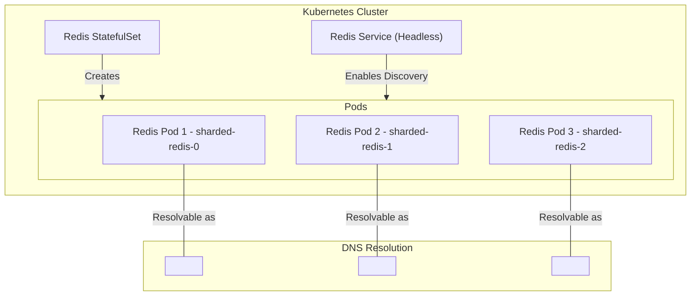

```mermaid
graph TD
    subgraph Cluster [Kubernetes Cluster]
        direction TB
        Service["Redis Service (Headless)"]
        StatefulSet[Redis StatefulSet]
        
        subgraph Pods
            A[Redis Pod 1 - sharded-redis-0]
            B[Redis Pod 2 - sharded-redis-1]
            C[Redis Pod 3 - sharded-redis-2]
        end
    end
    
    subgraph DNS [DNS Resolution]
        DNSA[<sharded-redis-0.redis>]
        DNSB[<sharded-redis-1.redis>]
        DNSC[<sharded-redis-2.redis>]
    end
    
    StatefulSet --> |Creates| Pods
    Service --> |Enables Discovery| Pods
    A --- |Resolvable as| DNSA
    B --- |Resolvable as| DNSB
    C --- |Resolvable as| DNSC
```