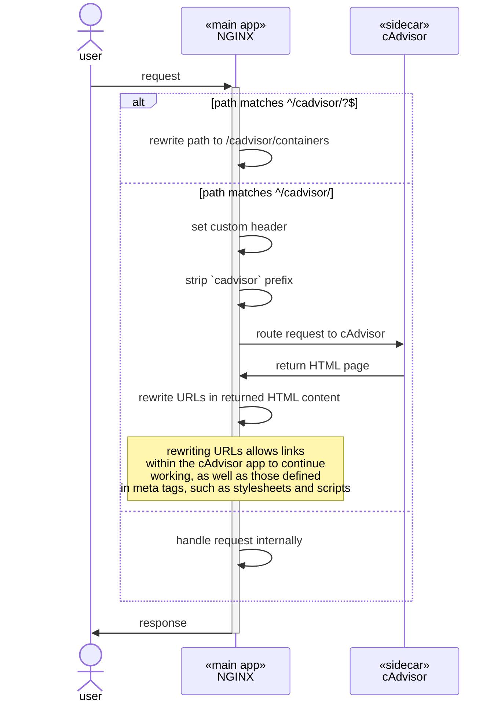

import Expandable from '@site/src/components/Expandable/Expandable'

### Solution Design
<Expandable expandPrompt="show diagram..." collapsePrompt="hide diagram">

```mermaid
sequenceDiagram
    actor user
    participant nginx as «main app»<br/>NGINX
    participant cadvisor as «sidecar»<br/>cAdvisor
    
    user ->> +nginx: request

    alt path matches ^/cadvisor/?$
        nginx ->> nginx: rewrite path to /cadvisor/containers
    else path matches ^/cadvisor/
        nginx ->> nginx: set custom header
        nginx ->> nginx: strip `cadvisor` prefix
        nginx ->> cadvisor: route request to cAdvisor
        cadvisor ->> nginx: return HTML page
        nginx ->> nginx: rewrite URLs in returned HTML content 
        note over nginx: rewriting URLs allows links<br/>within the cAdvisor app to continue<br/>working, as well as those defined<br/>in meta tags, such as stylesheets and scripts
    else 
        nginx ->> nginx: handle request internally
    end
    nginx ->> -user: response
```
</Expandable>