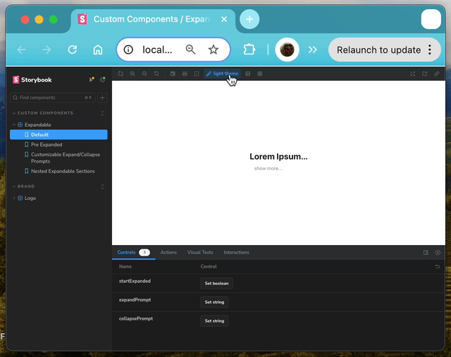

import Expandable from '@site/src/components/Expandable';

I thought it would be a good idea to have a central location to showcase
whatever components I add to the Docusaurus repertoire.

I'd worked with [Storybook](https://storybook.js.org/) before, and found it
pretty handy. During development, it gives you a way to interact with a component-in-progress and
see that it works as intended. It can serve as a beginning basis for unit and
component tests, and it can be a really handy tool for communicating with
non-technical stakeholders... clicking on a component and seeing immediately how
it responds is much easier to grasp than an engineer trying to explain something
to you in non-engineer-speak as best they can. The proof is in the pudding, as
they say.

TRUNCATE_HERE

Another nice feature is its extensibility. If it doesn't do something you want
it to do, you can often create an addon or a decorator that will accomplish it.

So I downloaded the dependency, and began writing stories for my shiny new
'Expandable' component.

Imagine my distress when I started up the development server for the first time
and saw that my themes weren't being applied to the custom element. I worked
hard to include those themes!

(I promise, I'm clicking the button in the screen recording shown below)


It took me a little while to track down the problem. It turns out that
Docusaurus and Storybook drive their theme-based styles off of different
conditions. Docusaurus applies a data attribute at the root of the HTML
document, which it then uses as the selector for its CSS styles. Storybook uses
the built-in `class` attribute.

I didn't want to pollute my code with a bunch of redundant attributes that
accomplish the same thing. Happily, I was able to leverage Storybook's
extensibility to solve that problem.

I created a Decorator... an object that Storybook, in essence, wraps _around_
your stories to provide new functionality. In this case, I captured the current
theme from the Storybook context, and set the `data-theme` attribute at the root
of the preview pane accordingly.

Here's my very simple decorator:
```typescript title='withDocusaurusStyles.ts'
import React from "react";
import { useEffect } from "react";

// apply a data attribute ('data-theme') at the root element of the
// Storybook preview iframe so that Docusaurus styles are applied
// within the preview
export default (Story, context) => {
    const { theme='light' } = context?.globals;
    useEffect(() => {
        const themeRoot = document.querySelector('html');
        themeRoot && themeRoot.setAttribute('data-theme', theme);
    }, [theme])

    return <Story />
}
```

I applied those to every published story via my `.storybook/preview.ts` file, and now my
themed Docusaurus components respond to the dark/light theme in Storybook!

```typescript title=".storybook/preview.ts"
import type { Preview } from "@storybook/react";
import './assets/styles/docusaurus_global.css'
import withDocusaurusStyles from './decorators/withDocusaurusStyles';
import { withThemeByClassName } from "@storybook/addon-themes";

const preview: Preview = {
  decorators: [
    // highlight-next-line
    withDocusaurusStyles,
    withThemeByClassName({
      themes: {
        light: 'light',
        dark: 'dark' ,
      },
      defaultTheme: 'light',
    })
  ],
  parameters: {
    controls: {
      matchers: {
        color: /(background|color)$/i,
        date: /Date$/i,
      },
    },
  },
};

export default preview;
```

Pretty pleased.



