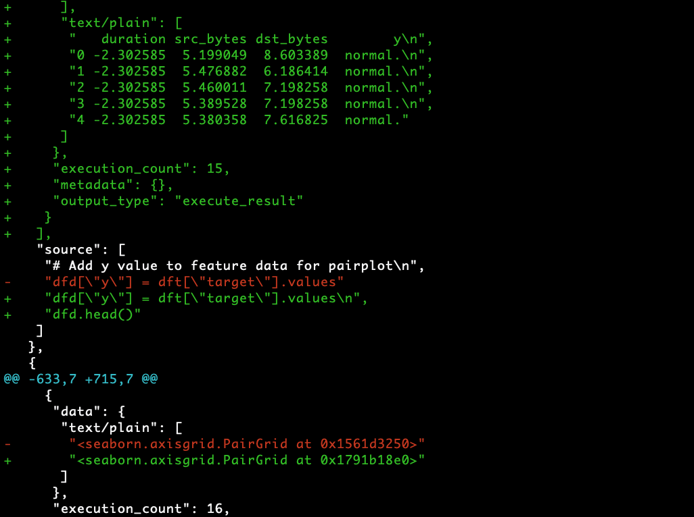
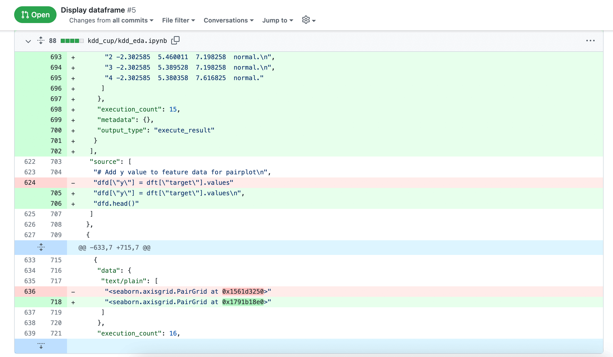
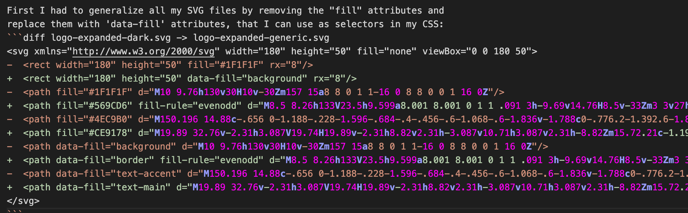
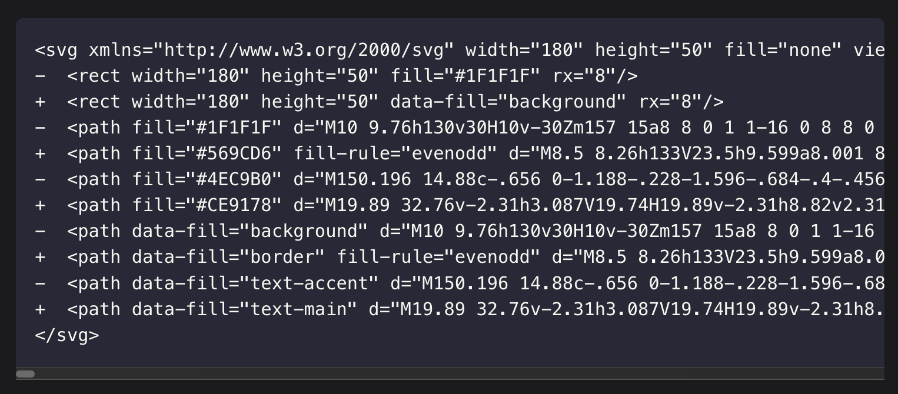

In my last blog post, I used a diff to show how my SVG files had changed.

For those who don't know a diff is an operation on two files that shows a graphical representation of how one is different than the other.

They look like this:
| on the command line  | in a nice UI like GitHub |
| -------------------  | ------------------------ |
|  |  |

The green lines show something being added, the red ones something
being removed. A change to a line will produce a red line AND a green
line in the output.

In theory, Docusaurs supports a notation to produce nicely formatted diff
output.

Indeed, in my VS Code editor, the lines prefixed with '+' were highlighted
green, and the ones prefixed with '-' were highlighted red. But in the rendered
page, there was no change from a standard code block:

| editor: right! | where it matters: wrong! |
| -------------- | ------------------------ |
|  |  |

I'm not the first to run into this problem (and in fact it's not the first time
I've run into it).

I found [this solution][credit-where-its-due] online:

Docusaurus relies on a library called 'Prism' for its syntax highlighting, and
Prism includes a feature called 'magic comments'. If you define a magic comment,
and then include that magic comment in your code blocks, prism will remove it
from the output and apply a CSS class to the next line, which you can use to
apply formatting. Docusaurus allows you to modify the Prism configuration (including
magic comments) from within its own configuration file.

Applied to my repository, it looks like this:

### Definition of magic comments:
```typescript title=docusaurus.config.ts
const config: Config = {
    // ... other docusaurus configuration options
  themeConfig: {
    // Replace with your project's social card
    // ... other theming configuration
    prism: {
        // ... other prism configuration
        // diff-add
      magicComments: [
        // diff-add
        {
        // diff-add
          className: 'code-block-diff-add-line',
        // diff-add
          line: 'diff-add',
        // diff-add
        },
        // diff-add
        {
        // diff-add
          className: 'code-block-diff-remove-line',
        // diff-add
          line: 'diff-remove'
        // diff-add
        }
        // diff-add
      ]
        // diff-add
    },
        // diff-add
  } ,
        // diff-add
};
```

adding variables and styles to my global style definitions:
```css title=src/css/custom.css
:root {
/* ...existing light-theme (default) variable defs styles... */
  // diff-add
  --iaindavisdev-diff-insertion: #b0f6ac;
  // diff-add
  --iaindavisdev-diff-deletion: #fcc8c0;
}

/* For readability concerns, you should choose a lighter palette in dark mode. */
[data-theme='dark'] {
    /* ...existing dark-theme variable defs styles... */
  // diff-add
  --iaindavisdev-diff-insertion: #254323;
  // diff-add
  --iaindavisdev-diff-deletion: #432723;
}

/* new styles! */
// diff-add
.code-block-diff-add-line {
// diff-add
  background-color: var(--iaindavisdev-diff-insertion);
// diff-add
  display: block;
// diff-add
  margin: 0 -40px;
// diff-add
  padding: 0 40px;
// diff-add
}
// diff-add

// diff-add
.code-block-diff-add-line::before {
// diff-add
  position: absolute;
// diff-add
  left: 8px;
// diff-add
  padding-right: 8px;
// diff-add
  content: '+';
// diff-add
}
// diff-add

// diff-add
.code-block-diff-remove-line {
// diff-add
  background-color: var(--iaindavisdev-diff-deletion);
// diff-add
  display: block;
// diff-add
  margin: 0 -40px;
// diff-add
  padding: 0 40px;
// diff-add
}
// diff-add

// diff-add
.code-block-diff-remove-line::before {
// diff-add
  position: absolute;
// diff-add
  left: 8px;
// diff-add
  padding-right: 8px;
// diff-add
  content: '-';
// diff-add
}
// diff-add

// diff-add
/**
// diff-add
 * use magic comments to mark diff blocks
// diff-add
 */
// diff-add
pre code:has(.code-block-diff-add-line) {
// diff-add
  padding-left: 40px!important;
// diff-add
}
// diff-add

// diff-add
pre code:has(.code-block-diff-remove-line) {
// diff-add
  padding-left: 40px!important;
// diff-add
}
```

And you can see the result in this post.

There's an added bonus: my code blocks now retain their _original_ syntax
highlighting as well as adding the diff highlights. In the default Docusaurus
diff highlighting, all formatting is stripped out except for the diff
highlights, unless you're willing to do some more work to shoehorn some more of
prism's native capabilities in to Docusaurus.

On the down-side, in the editor now, those blocks are littered with kind of
obnoxious comments that make it harder to read. Eventually, I will probably
implement [this more robust fix][ooh-even-better-but-also-harder] (from the same
thread as the quick-fix I've applied!):

For now, this was a solution I can implement (and document here) much more
quickly, so I'm happy with it for today.

[credit-where-its-due]:
    https://github.com/facebook/docusaurus/issues/3318#issuecomment-1909563681 "'Magic Comments' fix"

[ooh-even-better-but-also-harder]:
    https://github.com/facebook/docusaurus/issues/3318#issuecomment-2065547731 "More robust Prism-renderer fix"