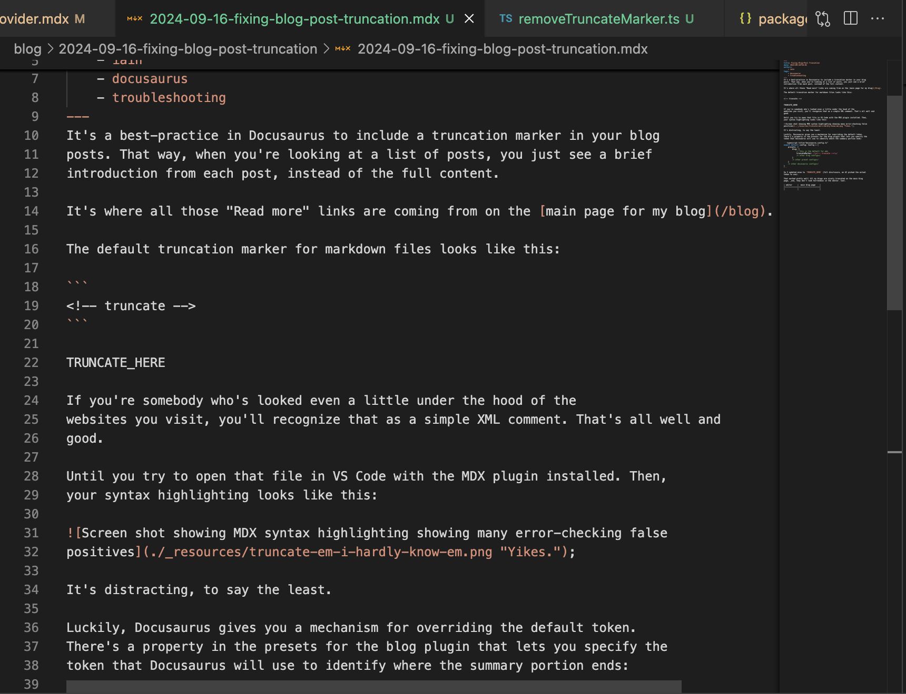
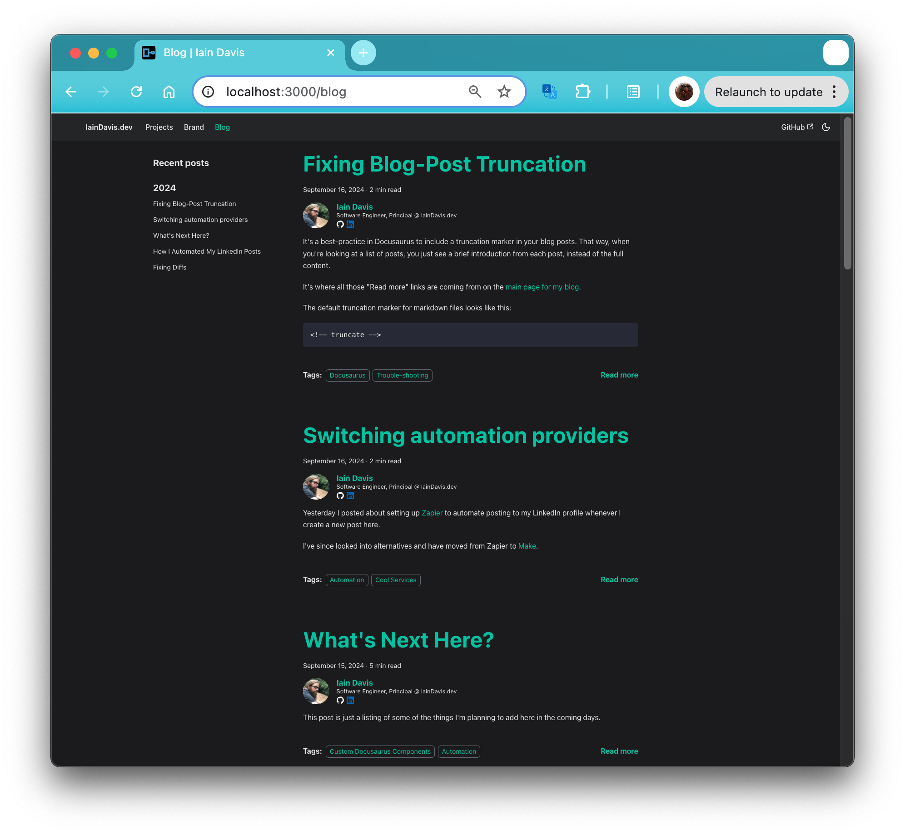

import Columbo from './_resources/there-is-just-one-more-thing.webp'

It's a best-practice in Docusaurus to include a truncation marker in your blog
posts. That way, when you're looking at a list of posts, you just see a brief
introduction from each post, instead of the full content of the first post
pushing the second post clear off the page.

It's where all those "Read more" links are coming from on the [main page for my blog](/blog).

The default truncation marker for markdown files looks like this:

```
<!-- truncate -->
```

TRUNCATE_HERE

If you're somebody who's looked even a little under the hood of the
websites you visit, you'll recognize that as a simple XML comment. That's all well and
good.

Until you try to open that file in VS Code with the MDX plugin installed. Then,
your syntax highlighting looks like this:

;

It's distracting, to say the least.

Luckily, Docusaurus gives you a mechanism for overriding the default token.
There's a property in the presets for the blog plugin that lets you specify the
token that Docusaurus will use to identify where the summary portion ends:

```typescript title="docusaurus.config.ts"
export default config: Config = {
    presets: {
        blog: {
            // this is the default for mdx
            truncateMarker: /\s<!-- truncate -->\s/
            /* other blog configs*/
        }
        /* other preset configs*/
    }
    /* other docusaurus configs*/
}
```

So I updated mine to `TRUNCATE_HERE` (full disclosure, an AI picked the actual
token to use).

That worked pretty well! All my blogs are nicely truncated on the main blog
page, _and_ they don't look horrendous in the editor. Cool.

| editor     |  main blog page    |
|------------|--------------------|
| |  |


:::caution There is just... one more thing

:::

Everything looks fine until you actually open the blog post:


Okay. I can fix this. Can I fix this? I'm pretty sure I can fix this.


It turns out yes. Yes, I can.

The solution is to add a custom Remark plugin that strips out that line
manually. Me and my friendly neighborhood artificial intelligence sorted it out.
It steered me a bit wrong, but eventually together we were able to sort it out.
Much faster than I'd have done it on my own, I'm sure.

You can see the AI transcript
[here](https://chatgpt.com/share/66e7d39f-9b30-8000-a12f-a9b8efa5992a) (it's
quite long, I don't actually expect you to look at that, but maybe somebody's
interested).

And my final solution in [the PR](https://github.com/IainDavis/iaindavis.github.io/pull/6)
