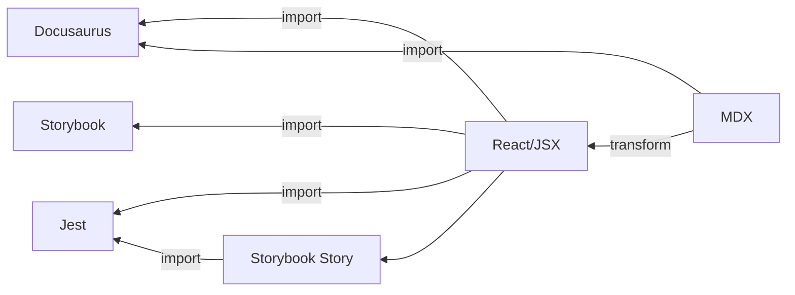

It's been a few days since I posted. That's not because I haven't been busy,
it's because setting up unit testing turned out to be _much harder_ than I
anticipated.

To be fair, I was trying to achieve a somewhat complex setup.

TRUNCATE_HERE

Honestly, I could have mocked the MDX inputs, and in a professional setting
that's what I would have done.

But what would I learn from that?

In the past, I've not really had to set up many JavaScript repositories. I've
joined an already active project, or used a paved road, and I just started
writing tests. I figured that's more or less what would happen here.

Part of the problem is that Docusaurus and Storybook both use webpack by
default, to preprocess and bundle code. Jest doesn't do that, so I had to figure
out how to emulate that behavior. In particular, I needed to tell it how to
handle the imported `.mdx` content. That turned out to be surprisingly
difficult. My AI coding assitant did their best to help, but I was getting a
considerable amount of hallucination and just outdated information. To make
things worse the problem was large enough that the AI seemed to keep forgetting
context and taking me back around paths we'd already been over.

In the end, we ended up creating a custom Jest transformer that leveraged the
`@mdx-js/mdx` library and babel to handle the transformation. That got us much
closer, but we began getting more errors from the produced JSX having
unrecognized attributes (`parentName`, `mdxType`) and including a `wrapper`
element that React didn't know what to do with.

Another round of fixes... the best solution I ended up with was monkey-patching
React.createElement in `jest.setup.ts` to have some special handling for the
`wrapper` component and strip out the unrecognized MDX elements.

And we got it working! I had two unit tests passing, one of which incorporated a
Storybook story, which in turn incorporated some boilerplate MDX content, which
is what I was trying to achieve.

Round of drinks, high fives all around, call it a night.

The next day, I fell victim to that most insidious of demons, the one that
whispers in your ear and says "yeah, go ahead and commit these changes but...
_while_ you're committing, shouldn't you just refactor a bit? Surely that bit
over there couldn't hurt anything. It's practically a separate module."

Needless to say, I broke my working solution. Part of (but I don't think all of)
the break had to do with upgrading my dependencies with yarn, so _I suspect_ it
would have broken eventually anyway, which is kind of disappointing, but also
makes me feel marginally less stupid about it.

The problem we began to run into was that `@mdx-js` has switched over to
ESModules-only. No more CommonJS support, which is what Jest expects to use. My
transformer wouldn't compile anymore, because it couldn't import anything from
`@mdx-js`.

Well that's fixable, right? We're using Jest 29, which supports transformers
that provide a `processAsync` method. Shouldn't be a problem. We'll just throw a
few async/awaits in there, rename the `process` method, and we'll be good to go.

Y'all, I tried for hours to get Jest to recognize that `processAsync` method.
When the `process` method was absent, Jest would throw an exception and not run
the transformer at all. When both `process` and `processAsync` were present,
Jest automatically preferred `process`, and no way I could figure out to force
it to use the async method so I could do a dynamic import of an ESModule in the
CommonJS context that Jest uses.

The last thing we tried was to abandon the Jest Transformer approach entirely
and try to write our own babel plugin, but we ended up with basically the same
errors.

No luck.

Finally, I decided if `Jest` was the problem, maybe it was worth pursuing
alternatives. I'm so used to Jest, it honestly didn't occur to me to use
anything else.

This morning I gave up and set up `Vitest`. I actually still had a little
trouble with ESModules/CommonJS importing, but resolving it was much, much
easier. I probably spent an hour on it this morning, total. That includes
learning a bit about it, adding the relevant VS Code extension and making the
changes.

I now have the same two unit tests running. I have fewer custom build components
(no Jest transformer, no Babel plugin, no monkey-patching of
`React.createElement`).

And I have to say, there's a noticable difference, even with my currently
trivial test suite, in how fast the tests run.

I'm a little disappointed that Docusaurus and Storybook are now on different
build tools than my tests, but I think the benefits far outweight the
disadvantages. And Storybook supports Vite, so I may migrate it eventually as
well. Unfortunately, Docusaurus is webpack-only for now.

## What I learned from all this
How different JS tools and build configurations hang together. This has always
been a bit of a frustrating thicket to wade into for me, and I feel like I
understand it just a little better after all this.

## How to go about modifying Webpack, Babel, Jest
It hadn't really occurred to me before to solve a problem by writing custom
extensions, and now I've written them for all three of these tools. It never
really seemed strange to me to write a decorator or addon for Storybook, and I
don't know why that should be any different really, but here we are. I guess
I've just been conditioned no to mess with the build.

## Persistence
I'd never do this in a professional setting, but I'm glad I chased the Jest
solution down. It was a pretty satisfying feeling to see that "2 tests passed"
after all the struggle it took to get there.

## Give up sooner
Okay, that's a contradiction. But I guess what I really mean is think outside
the box for another solution. I started with the assumption that "Jest is what
you use" and it cost me some time, even if it wasn't a total loss. I could have
gotten to a solution much sooner.

