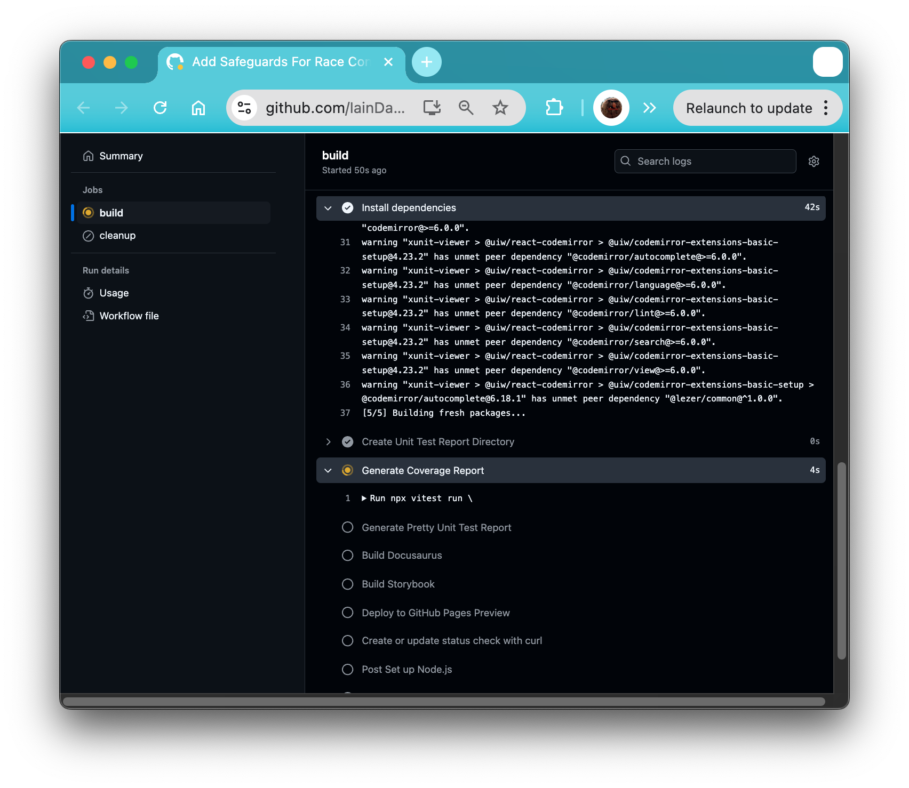
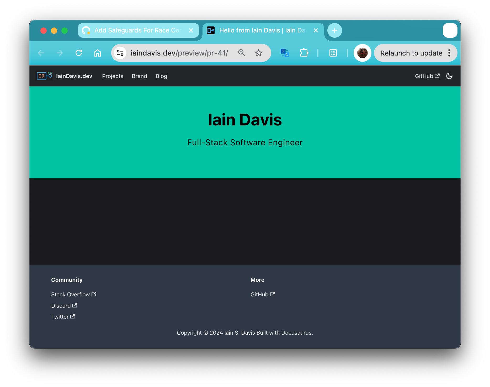
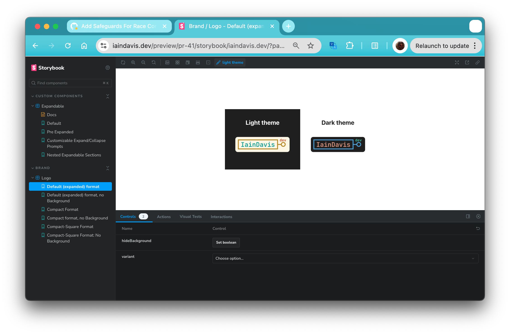
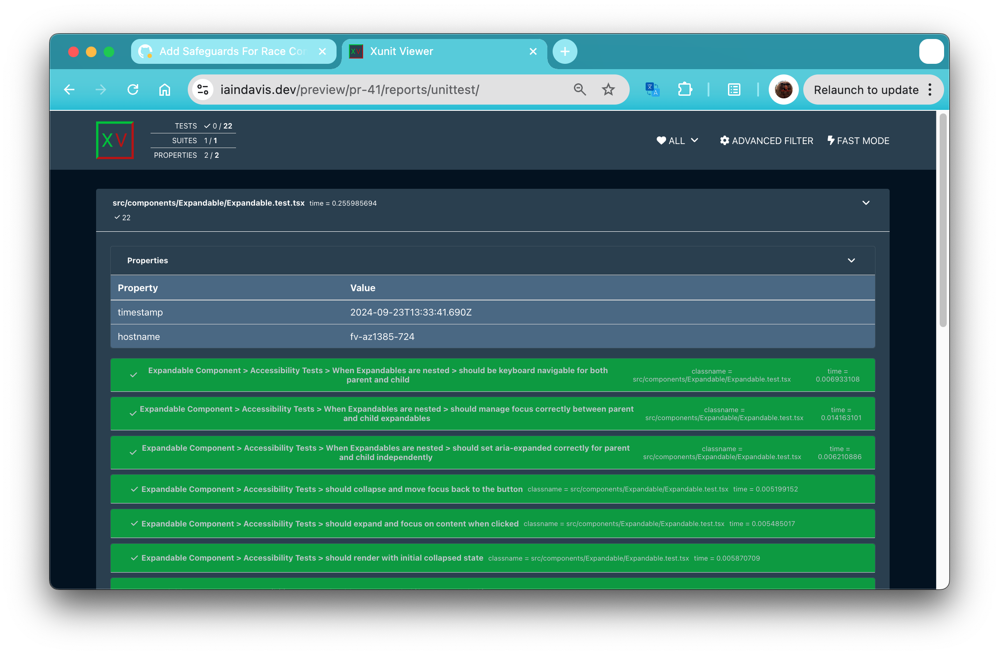
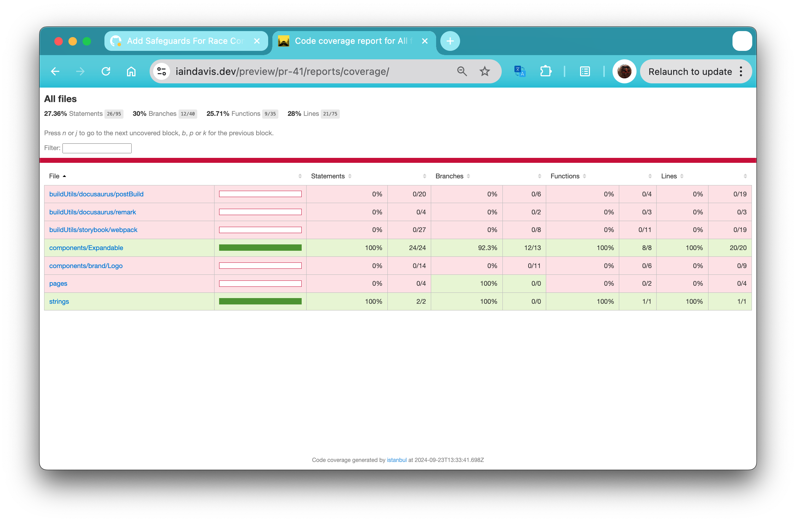

import Tabs from '@theme/Tabs';
import TabItem from '@theme/TabItem';
import Expandable from '@site/src/components/Expandable/Expandable';

:::info Editor's Note
Once the build completes developers can view their preview environment live at the following URL:
```
https://iaindavis.dev/preview/<pr-number>
```

For example, the PR that introduced this change produced the following preview URLS (no longer available due to cleanup): 
```
https://iaindavis.dev/preview/pr-40
https://iaindavis.dev/preview/pr-40/storybook/iaindavis.dev
https://iaindavis.dev/preview/pr-40/reports/unittest
https://iaindavis.dev/preview/pr-40/reports/coverage
```

### Screen Captures
<Expandable expandPrompt='show screenshots' collapsePrompt='hide screenshots'>
    <Tabs lazy>
        <TabItem value="Action in progress">
            **The build in progress:**
            
        </TabItem>
        <TabItem value="Landing Page">
            **The landing page** -- note the URL includes `preview/pr-41`
            
        </TabItem>
        <TabItem value="Storybook">
            **Storybook, built from the same commit as the previewed PR**
            
        </TabItem>
        <TabItem value="Unit Test Report">
            **Unit test report for the same commit as the previewed PR**
            
        </TabItem>
        <TabItem value="Test Coverage Report">
            **Coverage report for the same commit as the previewed PR**
            
        </TabItem>
    </Tabs>
</Expandable>
:::