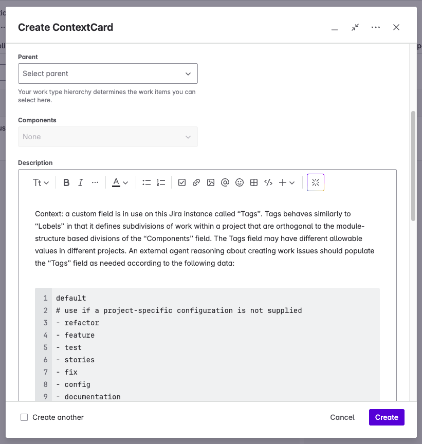
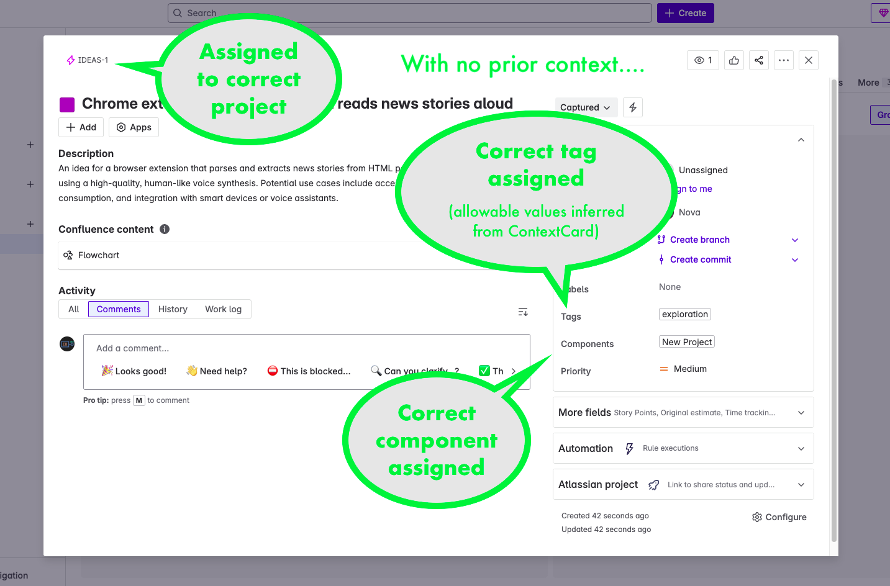

:::note TL;DR
I created a custom project and work type to expose Jira context to my AI assistant and work around limitations in the API and permissions model. Now I'm able to submit new work ideas, correctly categorized, with less friction.
:::

I've been pretty lax about working in a structured and organized way in my personal projects. Some of that has to do with life just kind of being a bummer lately. Unemployment is hard. But it also has to do with I just got into some sections of work that felt very unstructured and exploratory. I knew roughly where I wanted to get to, but I didn't know how to get there until I did a lot of learning and made a bunch of mistakes. Now, arguably, that's exactly the kind of stuff I should have been documenting. But _doing_ it took a lot of my time and energy. Today, we're where we are, and there's no use pretending we're somewhere else.

TRUNCATE_HERE

But the good thing about knowing where we are, is we get to decide what we're going to do next! And one of the things I'm going to do is, now that the work has settled into something that feels a little more predictable and structured, to return to the good practices that I was trying to follow when I first got laid off and decided to start pursuing my own projects so that I could have something to showcase to the world.

That means posting on this here blog, and tracking my work in Jira, and running something approximating a scrum workflow. I don't really want to work in Scrum, I'd much rather do Kanban for my personal projects, but I think it's important that I practice for my next role, which very often means Scrum.

Bad news though. I let it go so long that my Jira instance got deleted. In fact, I got a warning before that happened, and I contacted somebody at the help desk who assured me all I had to do to keep it live was to log in once in a while. I don't know if he was mistaken, or I misunderstood, or if it's just been longer since that conversation than I realize, but my Jira instance got deleted, and I'm left with not much to do but start over.

It may be a blessing in disguise though. When I first set up my Jira instance, I built in the way that I recognized from my time at Intuit, that is, a project-per-team. And since my "team" is only me and my AI assistant, Nova, that meant I had a single project with different work streams only identifiable by labels and components. Looking at it objectively, that never really made much sense, and even less so now that I have more than one project that I'm working on.

Rebuilding my Jira instance with a one-project-per-product model had some other benefits too. Now I have a Sandbox project where I can try things out with Jira configurations and integrations, and I can still keep any issues generated during those activities around for future reference without polluting my actual work-stream information. I also have an IDEAS project, where I can capture things that might be developed more fully into new epics, and might even spawn new projects (I've got several of these already that I want to capture). 

I also improved on my previous model by introducing a "Tags" field (which I'm seriously considering renaming... "Tags" is too generic for its purpose). The "Tags" field acts essentially the same as the standard "Labels" field, except that "Tags" only allows values from a defined set. Why is that useful? Suppose you're relying on labels to identify how much effort is going into various aspects of development. Suppose one of your team adds the label "docs" and another one adds the label "documentation". Now, to get an accurate picture, you _have to know both of those labels exist_. This strikes me as singularly error prone, so I invested the time to create a set of options that divide development work into different categories. These work in concert with the Components field. Components define where-in-the-project work is happening, _e.g._ a specific module or somewhere within the configuration-as-code, and "Tags" identify what sort of work it is, _e.g._, adding tests, a new feature, or refactoring.

All of this custom configuration comes at a cost. Previously, it was pretty easy for Nova to interact with my Jira instance. There was only one project key to know, and pretty much everything had the standard configuration. I needed Nova to be able to discover the current configuration on the fly, and to notice when it changes.

The obvious first step was to try to fetch all this through the API. Nova has a set of GPT Actions, and a dedicated OAuth2 app and account that allows login to my Jira instance, and this mostly works, but we did run into a wrinkle we couldn't resolve through the API. Discovering the allowed values for the "tags" field requires access to an "Edit Workflows" permission that is simply not grantable to a user who is authenticating via an OAuth2 log in flow. I'm not sure why that permission shouldn't be grantable, or why it's neaded to read a bit of configuration that would be perfectly viewable for the same user through the UI, but here we are.

The solution has been to add _another_ project to Jira, explicitly for exposing information in a way that Nova can retrieve it. I call this project "Nova Integration" or "NOVAINT", and it supports a single custom issue type (or work type, under the new naming scheme), which is `ContextCard`. Nova can retrieve ContextCards and treat anything in them as valid context for the remainder of the session.

Alternatives I considered

I considered several different approaches for providing Nova with the details of the Tags field

1. **abandoning it altogether**
    This is always a possibility. But I didn't relish the idea of having to remind Nova of the same information over and over again, especially considering there might be variations of the allowed values from one project to another. Also I'm quite stubborn.

1. **including it in Nova's instructions**
   This was the earliest and most obvious solution. Simple and direct, but it also would have me not only having to manually maintain Nova's instructions, but to do it outside of Jira. It seems prudent to me to control what Jira exposes from within Jira. I also wanted to avoid polluting Nova's instructions with a lot of detail. The more that's in there, the more likely Nova will get confused about something. Indeed, with just the instructions that _are_ there, we had to do a fair bit of troubleshooting to get Nova not to assume that one project was more important than the others, based on unrelated instructions.

1. **including it in Nova's knowledge base**
    This has the advantage of preserving separation of concerns and not polluting Nova's instructions with too much detail, but it suffers from the same need to control Jira-visibility from outside Jira.

## Consequence
The end result of all this is that Nova can now dynamically discover what is needed to smooth the creation of new issues in Jira based on our conversations. If we're discussing an idea, and I say "let's capture that as a ticket", Nova can infer the project, components, and tags that are relevant for that work, and populate the ticket as needed with minimal intervention.

:::tip failures
I also tried to create a different sort of ContextCard that included instructions, with the intent that Nova would perform whatever actions were in these, without being prompted, after providing the report of the current state of Jira. I could get the actions performed, but not without prompting. I may do some more work on this in the future, as I think I might have spotted what in Nova's instructions are causing confusion. Or it might just be that Nova takes her instructions before an action, and can't augment those instructions based on input recieved during that execution. Not really sure yet, but it seems like an interesting thing to experiment with.
:::
