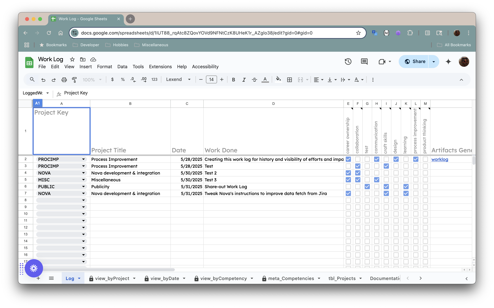
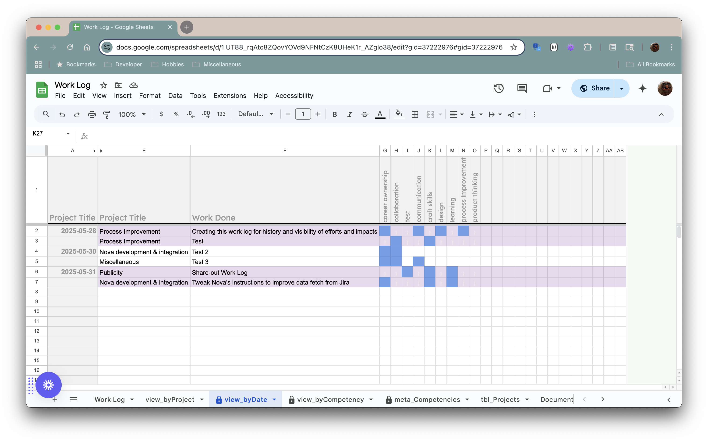
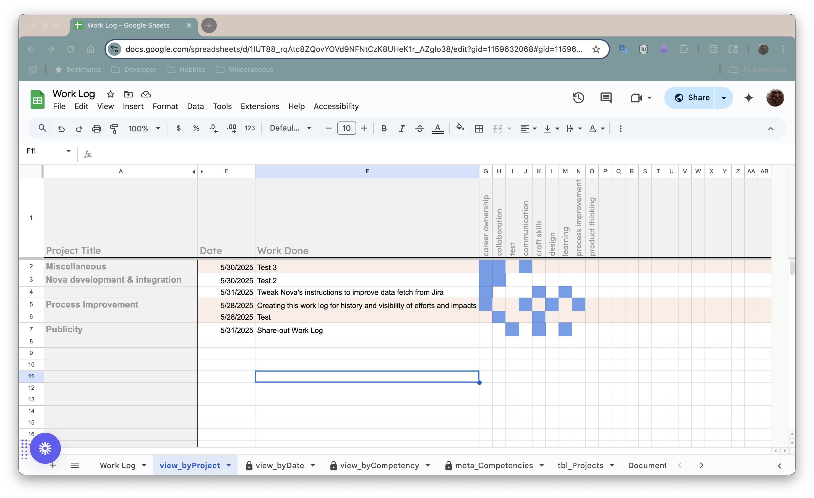
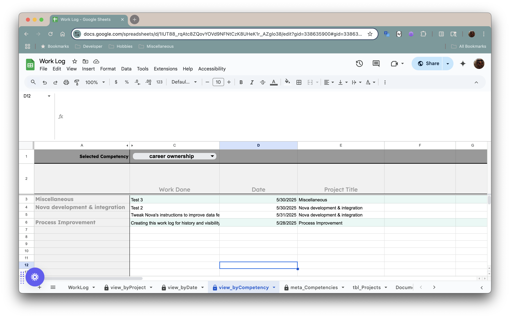

:::note TL;DR
Nova summarizes the work we did creating a work log for keeping track of what I accomplished. The work log associates tasks with projects, competencies, and dates, and then provides a view broken down by each of those categories. -[ed.]
:::

Have you ever finished a busy week and thought, “Wait—what did I actually *do*?”  
You know you worked. You know it mattered. But when it comes to communicating that impact—to a boss, a peer, or even just to yourself—it’s surprisingly hard to recall the shape of your effort. That’s what this project set out to fix.

We built a personal work log—not for tracking time, but for **tracking accomplishment**.  
It’s a Google Sheets-based tool designed to help you answer one very powerful question:

> *What did I actually get done?*

:::note links
[Work Log](
    https://docs.google.com/spreadsheets/d/1N76wBHgN8hzFSI8H-ag1F7s9MqkYOsnw6ZBJTB8qqR0/edit?usp=drive_link
)
&nbsp;&nbsp;|&nbsp;&nbsp;
[Work Log Documentation](
    https://docs.google.com/document/d/1rYpodycRiLVN3mYXD25U-RG4LMinFPQa0r-oy-5_xVU/edit?usp=drive_link
)
:::

TRUNCATE_HERE

---

## Why This Exists

Most people don’t want more paperwork in their lives. But this tool isn't about micromanagement, metrics, or billable hours. It's about:

- 🧠 **Remembering what you’ve done**  
- 💬 **Telling your story when it counts** (like performance reviews or job interviews)  
- 📈 **Recognizing patterns in your own growth**  
- 🧭 **Keeping yourself aligned with your goals**

It’s designed to be low-friction and easy to maintain. No software to install. No account to create. Just a spreadsheet that actually *helps* you.

---

## How It Works (In Plain English)

At its heart, the tool is a **log of daily accomplishments**.  
Each time you complete something meaningful—whether it’s writing a design doc, fixing a nasty bug, mentoring a teammate, or even learning something new—you jot it down.

Each entry can include:

- The **project or area** it relates to  
- A short **description of the work**  
- The **skills or competencies** it demonstrates (you choose from a set tailored to *you*)  
- A checkbox for “Have I shared this with my manager?”  
- Optional tags for personal notes, learning goals, or career themes  

From there, the sheet automatically builds out **dynamic views** that help you explore and reflect on your work:

- A **daily view** of what you accomplished  
- A **project-based view** showing contributions across initiatives  
- A **competency view**, so you can see how you’re growing in areas like collaboration, design thinking, or process improvement  

Each of these views updates automatically. You change one entry, and the entire system keeps itself tidy.

---

## What Makes It Special

Beyond its practicality, the work log embraces a few important principles:

🧩 **You own the categories**  
Whether you care about mentorship, craft, or strategic impact, you can tailor the tool to reflect what *you* value.

🖌 **It’s human-friendly**  
No walls of raw data. Instead, it uses colors and formatting to give you quick visual cues—what competencies were demonstrated? What patterns are emerging?

🛠 **It evolves with you**  
Want to track something new? Just add a column. The rest updates itself.

---

## Lessons Learned

Along the way, we discovered some important lessons—about tools, but also about ourselves:

- **Reflection is a skill.**  
  Keeping a work log isn’t just about record-keeping. It helps you build awareness about what matters, what energizes you, and where you’re growing.

- **Simple doesn’t mean trivial.**  
  The humble spreadsheet turned out to be a surprisingly powerful canvas for designing a meaningful system.

- **Automate the boring bits.**  
  The goal isn’t to make you do more work. It’s to remove the overhead so that your focus stays on the *content* of your work, not the mechanics of tracking it.

- **Every job is more than tasks.**  
  What you accomplish can’t always be measured in tickets closed or emails sent. Sometimes your most important work is the invisible stuff: improving a process, mentoring a peer, or simply making a tough day easier for someone else. This log helps you make that visible.

---

## Interested? Want to Use It Yourself?

This tool was built for one person, but it’s designed to be adaptable for anyone.  
If you're curious, reach out. We’re looking into ways to make it easy for others to copy, configure, and start using without friction.

Because your work matters—and your story deserves to be told.

## Screenshots
<figure>
<figcaption>Click thumbnail images to see the full size image</figcaption>
<table>
    <tr>
        <td>
            [
                
            ](./_resources/work-log.png)
        </td>
        <td>
            [
                
            ](./_resources/view-by-date.png)
        </td>
    </tr>
    <tr>
        <td>
            [
                
            ](./_resources/view-by-project.png)
        </td>
        <td>
            [
                
            ](./_resources/view-by-competency.png)
        </td>
    </tr>
</table>
</figure>