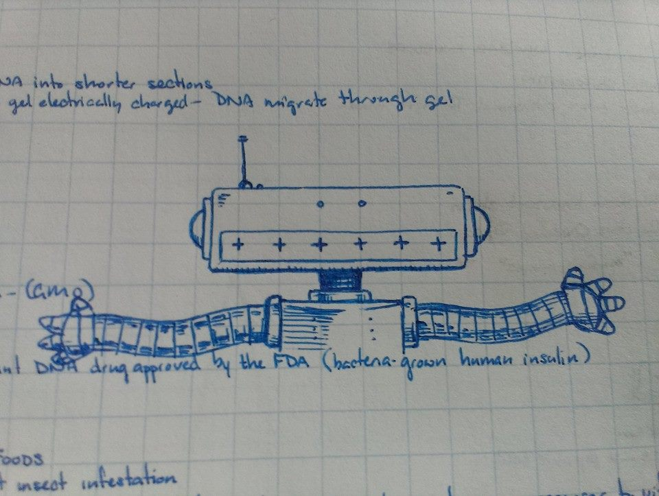
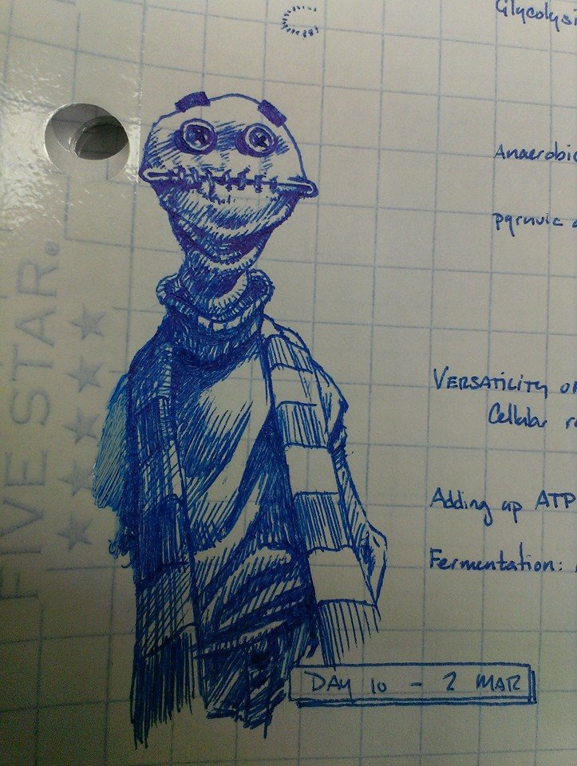
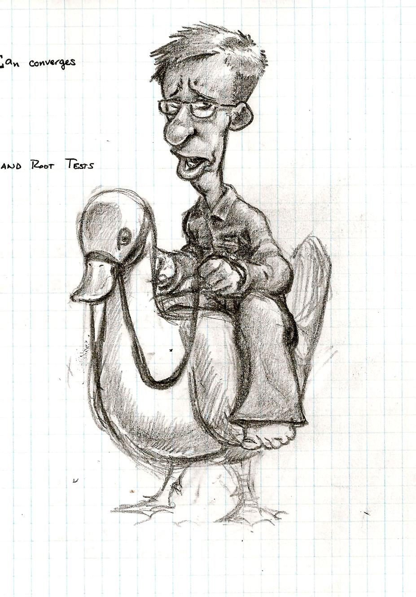
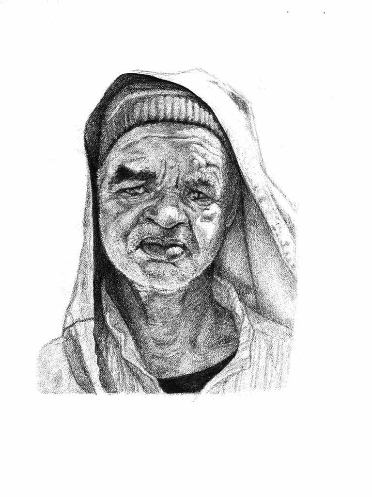
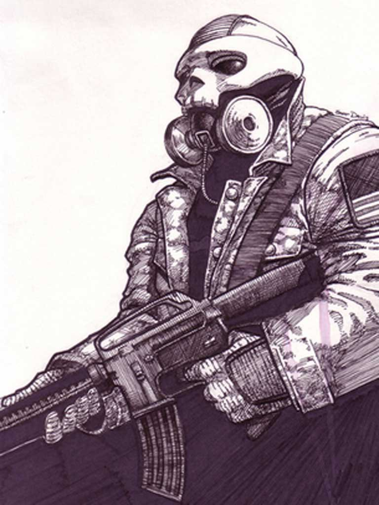
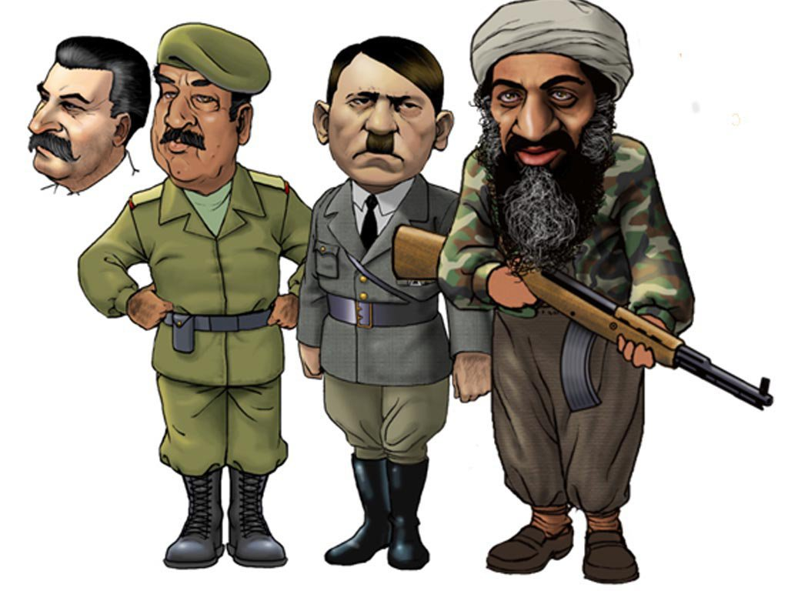
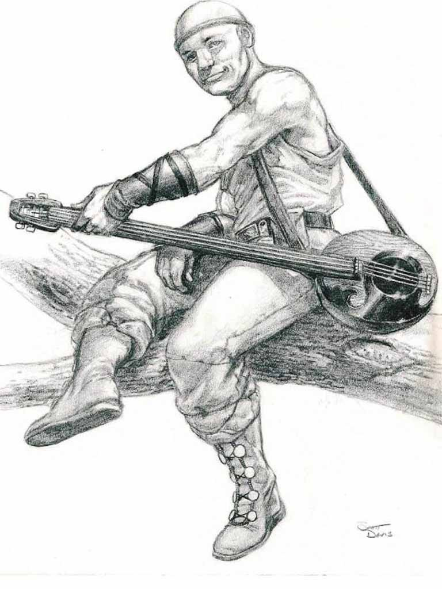

import { RightFloated, LeftFloated, ClearFloat } from '../_components';

### Home Life
<RightFloated>
    
</RightFloated>
I currently live in Kurrajong, NSW, Australia, along with my wife,
Rosalind (Roz), and ten-year-old daughter, Jamie. The family I grew up
with are all still in America, some in California, and some in
Colorado.

Kurrajong is a small community near the Blue Mountains, though still
part of the greater Sydney area. We're lucky enough to live on a large
wooded property with a creek running through it (after a rain, at any
rate) that we share with our landlords, who are like a second family
to us.  We have a dalmatian, Zoe, several chickens, and a handful of
wild parrots who, despite being wild and independent, are nevertheless
not too proud to take a handout.  Rozzie is a full-time student
pursuing a psychology degree, and does a great deal of gardening.
Jamie attends primary school, and has won the school spelling bee two
years in a row. She loves video games, drawing, and making animations
on her computer.

### Hobbies and Interests
Outside of work, I also enjoy video games. Started with an old Atari
2600 that was in the back bedroom at my grandmother's house in the
1980s, and never quit right up to today, when I play on my ROG Ally X.
Thanks to Humble Bundle and seasonal sales, I have an extensive Steam
library of games I haven't ever played. Big fan of Assassin's Creed
games, but I also enjoy anything clever and quirky (which mostly come
from indie studios).

I love movies -- from all eras, and all countries. From big Hollywood
blockbusters to quirky little independent films nobody watched but me
and four other weird nerds. Some of my favorite filmmakers are
Jean-Pierre Jeunet (Amelie) and Charlie Kaufman (Being John Malkovich,
Eternal Sunshine of the Spotless Mind).

<LeftFloated>
    
    
</LeftFloated>

I've been a musician since childhood. I grew up playing the trombone
and various other low-brass instruments. That carried me around the
western portion of America when I did summer tours with marching bands
Santa Clara Vanguard (at 12) and Spirit of Sunnyvale (at 15). It put
me into musical theater when I played in the orchestra pit on West
Side Story and The Sound of Music. And it introduced me to The
Smothers Brothers when I played an awards show they were hosting.

In the military, I picked up the guitar to compete in a "Battle of the
Bands" with some friends of mine. We formed a punk band. We weren't
good, but we had fun.  After the military, I started performing by
myself at open-mics as a singer and guitarist, mostly playing easy
old rock and folk tunes. That led to being in a folk duo with my good
friend Cap for about five years. We never made any real money from it,
but we had a fair few free beers and the odd bite to eat. And we got
to sing for a lot of nice people at a lot of nice events.

I was an aspiring artist in younger years. All I wanted to do was draw
comic books. I still love comic books, and I still sometimes find ways
to apply those skills. That usually means creating logos for friends,
or work events, or just people doing good work who need a little help.
Once in a while I'll do a proper illustration for somebody.

I find it harder to make time for reading novels than I used to, but I
still love a good story when I can get into one. I've read a lot of
Stephen King, and Kurt Vonnegut, a good bit of Sherlock Holmes, and
quite a lot of assorted flavors of science-fiction.  I'm slowly coming
around on fantasy novels. As of this writing, I'm re-reading The Lord
of the Rings, prompted by the series, The Rings of Power.

I still do custom picture framing as a hobby. I'm slowly building up a
set of tools so that I can make a little spending money in my
retirement from it. I recently acquired a pretty respectable mat
cutter, which is a big step on that journey.

---

<iframe width="560" height="315" src="https://www.youtube.com/embed/huG-ZQph_cc?si=x11tfyQ81IU6yylH" title="YouTube video player" frameborder="0" allow="accelerometer; autoplay; clipboard-write; encrypted-media; gyroscope; picture-in-picture; web-share" referrerpolicy="strict-origin-when-cross-origin" allowfullscreen></iframe>

---

    
 

    

    

    

    

    

    

    

    

