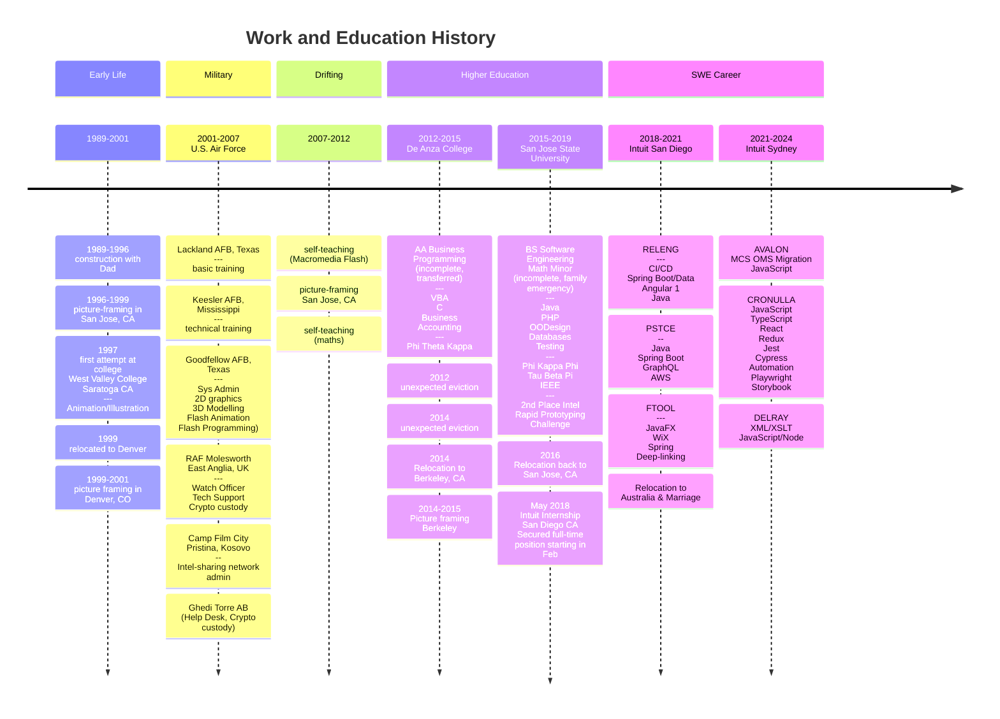

```mermaid
timeline
    title Work and Education History
    section Early Life
        1989-2001: 1989-1996<br>construction with Dad
                 : 1996-1999<br>picture-framing in San Jose, CA
                 : 1997<br>first attempt at college<br>West Valley College<br>Saratoga CA<br>---<br>Animation/Illustration
                 : 1999<br>relocated to Denver
                 : 1999-2001<br>picture framing in Denver, CO
    section Military
        2001-2007<br>U.S. Air Force: Lackland AFB, Texas<br>---<br>basic training
                 : Keesler AFB, Mississippi<br>---<br>technical training
                 : Goodfellow AFB, Texas<br>---<br>Sys Admin<br>2D graphics<br>3D Modelling<br>Flash Animation<br>Flash Programming)
                 : RAF Molesworth<br>East Anglia, UK<br>---<br>Watch Officer<br>Tech Support<br>Crypto custody
                 : Camp Film City<br>Pristina, Kosovo<br>--<br>Intel-sharing network admin
                 : Ghedi Torre AB (Help Desk, Crypto custody)
    
    section Drifting
        2007-2012: self-teaching (Macromedia Flash)
                 : picture-framing<br>San Jose, CA
                 : self-teaching<br>(maths)

    section Higher Education
        2012-2015<br>De Anza College : AA Business Programming (incomplete, transferred)<br>---<br>VBA<br>C<br>Business<br>Accounting<br>---<br>Phi Theta Kappa<br>
                 : 2012<br>unexpected eviction
                 : 2014<br>unexpected eviction
                 : 2014<br>Relocation to Berkeley, CA
                 : 2014-2015<br>Picture framing<br>Berkeley
        2015-2019<br>San Jose State University : BS Software Engineering<br>Math Minor<br>(incomplete, family emergency)<br>---<br>Java<br>PHP<br>OODesign<br>Databases<br>Testing<br>---<br>Phi Kappa Phi<br>Tau Beta Pi<br>IEEE<br>---<br>2nd Place Intel Rapid Prototyping Challenge
                 : 2016<br>Relocation back to San Jose, CA
                 : May 2018<br>Intuit Internship<br>San Diego CA<br>Secured full-time position starting in Feb
    section SWE Career
        2018-2021<br>Intuit San Diego
                 : RELENG<br>---<br>CI/CD<br>Spring Boot/Data<br>Angular 1<br>Java
                 : PSTCE<br>--<br>Java<br>Spring Boot<br>GraphQL<br>AWS
                 : FTOOL<br>---<br>JavaFX<br>WiX<br>Spring<br>Deep-linking
                 : Relocation to Australia & Marriage
        2021-2024<br>Intuit Sydney
                 : AVALON<br>MCS OMS Migration<br>JavaScript
                 : CRONULLA<br>JavaScript<br>TypeScript<br>React<br>Redux<br>Jest<br>Cypress<br>Automation<br>Playwright<br>Storybook<br>
                 : DELRAY<br>XML/XSLT<br>JavaScript/Node<br>
```
