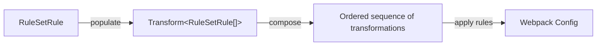

import Expandable from '@site/src/components/Expandable/Expandable'

## Webpack
Storybook and Docusaurus both rely on Webpack, but with different basic
assumptions.

<Expandable>
### File Formats
#### MDX
The bulk of the content that will be passed to custom React components
is defined as MDX. Storybook knows how to ingest MDX fies when they
are definitions for stories or documentation pages within the Storybook realm,
but when MDX is imported as part of a component-under-test, Storybook fails.

#### SVG
Docusaurus is, by default, configured to import SVG files as React
components using [SVGR][svgr]. Storybook does not know about this dependency,
even with the babel configuration in place

    _see [my Logo component][logo-component] for an examples of
    SVG images being imported, then used as React components._

When a component-under-test imports SVG in this way, Storybook fails,
because Storybook is trying to import the SVG as text.

### Solution
The solution fixes both of these issues, with the added benefit of aligning the
Docusaurus and Storybook Babel configurations (which solved some additional
issues with JSX loading correctly).

The solution is a small module that transforms a webpack configuration.
Currently the only transformations are applied to the 'module.rules' array, but
the module is easily extensible to apply to other portions of the config object.

A rule is an object conforming to the TypeScript type `RuleSetRule`, provided by
webpack.

[rules][rules]

A Transform is a function that accepts a `RuleSetRule[]` and produces another
`RuleSetRule[]`, assumed to be a transformation of the first set. Used to apply
a single rule.

[transforms][transforms]

The [webpackFinal][webpack-final] function applies the above logic to
the original configuration logic.

This approach is highly maintainable and extensible

The current rules applied:
* Ensure Storybook is using the same babel config as Docusaurus (solving JSX and
  MDX issues)
* Exclude Storybook from importing SVG files using any default configuration
* Prompt Storybook to import SVG using SVGR (as Docusaurus does)
</Expandable>

{/* NAMED LINKS */}
[logo-component]:
    https://github.com/IainDavis/iaindavis.github.io/blob/main/src/components/brand/Logo/Logo.tsx#L2
    "src/components/brand/Logo/Logo.tsx"
    
[svgr]: https://react-svgr.com/ "react-svgr"

[rules]:
    https://github.com/IainDavis/iaindavis.github.io/blob/main/src/buildUtils/storybook/webpack/webpackRules.ts
    "Set of defined webpack rules"

[transforms]:
    https://github.com/IainDavis/iaindavis.github.io/blob/main/src/buildUtils/storybook/webpack/webpackTransforms.ts
    "Essentially reducer functions that apply rules in various ways"

[webpack-final]:
    https://github.com/IainDavis/iaindavis.github.io/blob/main/src/buildUtils/storybook/webpack/webpackFinal.ts
    "Function that composes and applies transformations"